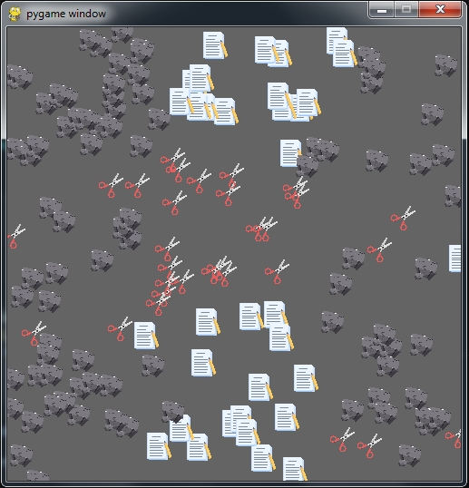

Песочница «Камень-Ножницы-Бумага»: 150 спрайтов случайно блуждают по полю, сталкиваются и побеждают согласно правилам КНБ.



*Функции*
- равное количество камней, ножниц и бумаг  
- картинки-клипарты (`./img/rock.png scissor.png paper.png` 30×30 пикселей)  
- случайное движение ±5 пикселей, отскок от границ  

*Запуск*
```bash
pip install pygame
python knb_swarm.py
```
*Управление*  
Закрыть окно – выход.  
Скорость и размер объекта настраиваются переменными `speed` и `obj_size`.


